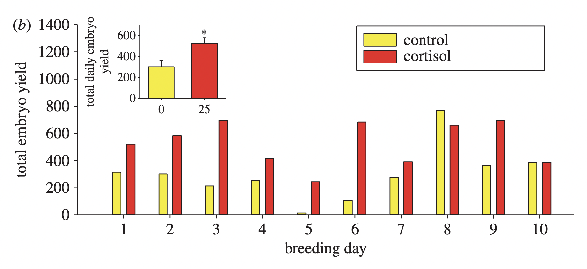
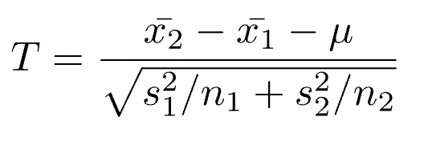
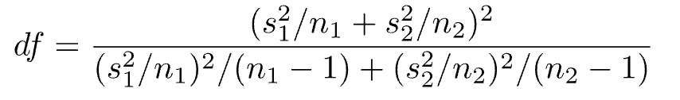

```{r setup, include=FALSE}
knitr::opts_chunk$set(echo = TRUE, warning = FALSE, comment = "##", prompt = TRUE, tidy = TRUE, tidy.opts = list(width.cutoff = 75), fig.path = "img/")
```
<p align="center"></p>

# Introduction and Paper Information
For the final AN588 Assignment (Data Replication), I have decided to use [*Maternal stress-associated cortisol stimulation may protect embryos from cortisol excess in zebrafish*](https://royalsocietypublishing.org/doi/epdf/10.1098/rsos.160032) as my subject article. This paper explored the effects of maternal stress levels in zebrafish on embryo cortisol content in order to understand the developmental defects and poor survival that arise. The researchers hypothesized that an increase of cortisol in the mother leads to elevated cortisol in embryos.

In order to test this question, they gave zebrafish cortisol-laced diet for five days, then most of the fish were  breed (some were euthanized to measure maternal body and ovary cortisol content) and the eggs were collected, frozen, and the cortisol quantified. It was found the cortisol increased mean embryo yield. Additionally, it was tested whether cortisol surplus affected 11βHSD2 expression, an enzyme that regulates cortisol by converting it into its inactive form (cortisone), in ovarian follicles. An increase of 11βHSD2 expression was observed, suggesting strict regulation of cortisol levels in ovarian follicles and a transient state of increased cortisol. Overall, it is concluded that there is tight regulation of cortisol by 11βHSD2 pathway, in order to prevent excess embryonic cortisol content, which leads to developmental issues.

The article performs a multitude of statistics and analyses, including Student's t-test, one-way and two-way ANOVA with post hoc, and F-test, which proves that this article is good to use for this assignment.
</br>
</br>
</br>
As someone who enjoyed both physiology and developmental psychology, I took this assignment as an opportunity to combine both areas and find an article that looks at how stimulants on the mother affect their offsprings. I chose this article because it relates to my major (biology) and it is very interesting to read how other species regulate cortisol and the developmental difference among species.

The original dataset for the entire paper came in the form of an .xlsx file (can be find in "WorkingDatasets" folder in the repository). I isolated the raw data for the chosen figure and converted into it into a .csv file, located in the same folder because the original .xslx file contained multiple tabs which do not have a way to convert into .csv.

Firstly, I will recreate Figure 2b of the article. I chose this specific figure because I wanted to recreate the superimposed bar plot as a challenge. During the creation of the smaller bar plot, I perform a descriptive statistic (the mean) as well as inferential statistic(standard error). I also perform a Student's two sample t-test upon the data for the figure and analyze the differences in between my analysis and the article's analysis. 

```{r prelims, message=FALSE, results='hide'}
library(tidyverse) #Contains ggplot2 and other useful things
library(curl) #For retrieving data from github
library(gridExtra) #Superimposing one plot upon another
library(patchwork) #Helps with formatting the plot
library(sciplot) #Some statistic functions
```
# Figure Replication
I will be replicating Figure 2b (shown below, with caption) from my selected article, which consists of 2 bar plots: one (smaller) plot of the total average embryo yield between the control group and the cortisol group (with a standard error of means), and the other, larger plot which depicts the embryo yield of each group per breeding day (no standard error bars).</br>


*(b) Total daily embryo yield. Embryos (1 h post-fertilization) were collected daily over a 10-day breeding period following 5 days of feeding cortisol-laced food(25 μg cortisol(g body mass)^−1^d^−1^).Values represent the total number of embryos collected for each day of the 10-day breeding period.Inset:meandailyembryoyield.Values represent the mean ±s.e.of daily mean embryo yields over a 10-day breeding period. Asterisks indicate significant differences (Student’s t-test,t=−2.806,p=0.0117,n=10).*

## Priming the Raw Dataframe:

First lets load in the .csv file of the figure data, which I placed in my Github repository.
```{r load in figure data}
d <- curl("https://raw.githubusercontent.com/A-Malik03/AN588_AnalysisReplication/main/WorkingDatasets/Figure2B.AN588Replication.csv")
d <- read.csv(d, stringsAsFactors = F) #I saw Jimmy use just the letter which I think is cool. I still prefer writing the entire word.
head(d) #Let's take a look. . .
```
It appears the first row is seen as part of the data, not the headers. Let's correct that.
```{r df headers}
names(d) <- d[1,] #Set the headers to be the first row(Day, Treatment . . .)
d <- d[-1,] #Remove the row of headers
d[, 4] <- as.numeric(d[, 4]) 
#Coerce the embryo yield to numeric values, because it is seen as character values which may cause problems later on
head(d) #Behold! The new and improved raw dataframe

```
I feel like having the "Total" column is kind of cheating because that's the column needed for the graphs and it can be argued that its not really raw data since it is technically "processed"; it is also a nice little challenge to do. I'm going to remove the "Total" column and remake it.
```{r final dataframe}
d <- d[, -5] #Removes the fifth column in data frame, a rudimentary way but since I have only a few columns its the most efficient compared to using the subset() or other functions

#The data is made so nicely that there are consistently three data points per group(25ug/g and Vehicle), so I'm going to create a vector of totals using every 3 Embryo rows and then add it as a new column with 2 spaces per input by adding NA's
Total <- c(rbind(colSums(matrix(d$Embryos, nrow= 3)), NA, NA )) #Makes a vector of totals with 2 "spaces"/NA's between them. I used matrix because it was able to create a matrix of each group, which makes an easy setup to use colSums function to add up each group to create a vector (Total) containing all the totals embryo yields
Total #Looks to have the same values as its predecessor
d <- as.data.frame(cbind(d, Total)) #Add the Total vector as a column to the raw dataframe
d[, 5] <- as.numeric(d[, 5]) #Make it numeric to prevent any problems should they arise
head(d) #Voila!

```
Now that we have the table primed and ready, lets extract the data for the figure, starting with the large bar plot, which compares the total yield of the treatment groups (25 ug/g of cortisol) per day and the control group(Vehicle).
```{r bigplot data}
totalembryos <- c()
Treatment <- c()
breedingday <- c() #initiate dummy vectors
for (i in seq(from = 1, to = length(Total), by = 3)) { #Create a loop that looks at all the Totals(aka every three rows to make it run more efficiently)
  breedingday <- append(breedingday, d$Day[i]) #Add the breeding day of the row to vector
  Treatment <- append(Treatment, d$Treatment[i])
  totalembryos <- append(totalembryos, d$Total[i])
}
bigplot <- data.frame(breedingday, Treatment, totalembryos) #Place all our required data in another dataframe
bigplot #Lets take a look at what we've generated
```
## Large Bar Plot:
```{r finalbigplot}
plot1 <- ggplot(bigplot, aes(x = breedingday, y = totalembryos, fill = forcats::fct_rev(Treatment))) + #I found that using the fill parameter flips the order of the plot(before it was 25 ug/g first then vehicular)
  geom_bar(stat="identity", position = "dodge", color="black", width = .7) + #Make a double barplot with black outlines and a width of 0.6
  labs(x = "breeding day", y = "total embryo yield") + #Label the axis respectively
  scale_y_continuous(limits = c(0, 1400), breaks = seq(0, 1400, by = 200)) + #Label axis intervals the same as the figure
  scale_x_discrete(limits = c(1: 10)) + 
  scale_fill_manual(values = c("yellow", "red")) + #Give the barplot their respective colors

  theme(legend.title=element_blank(), #Do not give the legend a title
        panel.grid.major = element_blank(), 
        panel.grid.minor = element_blank(),
        panel.background = element_blank(), #Removes all the grid lines 
        axis.line = element_line(colour = "black")) #Axis has a black line
  
plot1 #Let's take a look at the final actual bigplot
```
</br>Nice! I think I replicated it almost identically. Lets move on to the second, smaller plot.

## Small Bar Plot & Descriptive Statistic:
We can use the bigplot data frame since the small plot uses the totals, not the individual embryo yield. This is also an opportunity to do an inferential statistic, the standard error of mean. The standard error of means is based on a sample, and is calculated by dividing the sample standard deviation by the square root of the number of observations (AN588 Module 7: Central Tendency and Variance).
```{r smallplot data}
cntrl <- bigplot[bigplot$Treatment == "Vehicle ", "totalembryos"] #Place all totalembryos from the control group into a vector called cntrl
cort <- bigplot[bigplot$Treatment == "25 ug/g", "totalembryos"] #Do the same for the cortisol group
Means <- c(mean(cntrl), mean(cort)) #Find the two means, a descriptive stat

group <- rbind("0", "25") #Plot the 2 groups
SEM <- c(sd(cntrl)/sqrt(10), sd(cort)/sqrt(10)) #Get the standard error of means, an inferential stat
smallplot <- data.frame(group, Means, SEM) #Put them all together to form the smallplot dataframe
smallplot
```


```{r final smallplot}
plot2 <- ggplot(smallplot, aes(x = smallplot[,1], y = Means)) + 
  geom_bar(stat="identity", fill= c("yellow", "red"),color="black", width = .9) + 
  labs(x = NULL, y = "total daily embryo\n  yield") +
  scale_y_continuous(limits = c(0, 600), breaks = seq(0, 600, by = 200)) + 
  theme(legend.title=element_blank(), 
        panel.grid.major = element_blank(), 
        panel.grid.minor = element_blank(),
        panel.background = element_blank(), 
        axis.line = element_line(colour = "black")) + 
  geom_errorbar(aes(ymin = Means, ymax=Means+SEM), width=.2, #Adds upper error bars to plot
                 position=position_dodge(.9)) +
   annotate("text", x = 2, y = 600, label = "*") #since there is no way to add the asterisks the way it is shown in the paper, I will just add it as an annotation
 plot2 #Take a look at the small plot
```
</br>To double check that there is significance between the two means we can used the means and the standard errors to see if they overlap.

```{r errorbars}
mean(cort) - sd(cort)/sqrt(10) #The lower bar of cortisol bar, which they did not include in the article figure
mean(cntrl) + sd(cntrl)/sqrt(10) #The upper bar of the control bar
```
</br>Since the bars do not overlap, the researchers concluded that there is a significant difference between the total embryo yield of cortisol-fed zebrafish and the control group zebrafish. However, as mentioned in class, the standard error of mean bars are difficult to interpret and do not provide as much (accurate) information regarding the data.

Now lets put them together. I found the inset_element() function from the package {patchwork} which can place plots upon plots.
```{r combined barplot}
complots <- plot1 + inset_element(plot2, left = 0.001, bottom = 0.5, right = .4, top = 0.95) #inset the smallplot(plot2) into the bigplot(plot1) at the given side coordinates
complots #And now for the final look, with the actual figure below it for comparison
```


</br>I think I did a pretty good job. The data and their analysis to obtain the data are also correctly performed.</br>

# Inferential Statisitcs
<p align="center"></p>


</br>For the inferential statistic analysis replication, I chose the t-test performed on the same data used for the figure. The figure caption for this figure states the test used and the results for the test, there's the snippet:</br>
*"(b) Total daily embryo yield. Embryos (1 h post-fertilization) were collected daily over a 10-day breeding period following 5 days of feeding cortisol-laced food(25 μg cortisol(g body mass)^−1^d^−1^).Values represent the total number of embryos collected for each day of the 10-day breeding period.Inset:mean daily embryo yield. Values represent the mean ±s.e. of daily mean embryo yields over a 10-day breeding period. Asterisks indicate significant differences (Student’s t-test,t=−2.806,p=0.0117,n=10)."*
</br>
The researchers chose to do a two-tailed two sample t-test, which makes sense since you are comparing means of two distinct samples, and the null hypothesis is that the difference between means is 0. Here is the formula for calculating a t-test (Obtained from AN588 Module 10: Classical Hypothesis Testing):

<p align="center"></p>

## T-test:
Here is finding the t-statistic using the t.test function:
```{r ttest function incorrect}
#Simple way is using the t.test function, as we've used in class
 t.test(x= cntrl, y= cort, mu = 0, alternative = "two.sided")
```
## Degrees of Freedom Discrepency:
The t-test function gave the right t-statistic, but incorrect degrees of freedom and p-value. This is because the t-test function calculates degrees of freedom with this equation (AN588 Module 10: Classical Hypothesis Testing):
<p align="center"></p>

We can double check this:
```{r df calc}
df <- ((  ((sd(cntrl)^2)/10) + ((sd(cort)^2)/10))^2) / (((((sd(cntrl)^2)/10)^2) / (10-1)) + ((((sd(cort)^2)/ 10)^2)/(10-1)))
df
```
This is the calculation performed because it does not assume equal variance (which is classified as a Welch's t-test, as displayed on the top of the output of the function above), we can switch it by changing the default argument for var.equal to TRUE, to assume equal variance(which is known as a Student's t-test). The general rule for assuming equal variance is if the ratio of the larger variance to the smaller variance is less than 4. Lets see if the variance can be assumed to be equal.
```{r equal variance?}
varcort <- sd(cort)^2
varcntrl <- sd(cntrl)^2
#The control variance is larger, so it will be on top
ratio <- varcntrl / varcort
ratio #Check to see if it's less than 4
```
Look's like we can assume equal variance, now we can perform the Student's t-test.
```{r ttest function correct}
#Simple way is using the t.test function
 t.test(x= cntrl, y= cort, mu = 0, alternative = "two.sided", var.equal = TRUE)
```
The t-statistic and the p-value match up with what the researchers calculated, but the degrees of freedom are still off. This is because the researchers incorrectly calculated the degrees of freedom. For a two-sample t-test, the degrees of freedom is calculated by the equation dF = $n_1$ + $n_2$ — 2. But otherwise seems alright.

# Conclusion
Overall, the articles seems to have done their statistics correctly, but had an error (and most probably errors due to multiple t-tests and other tests performed) in reporting the statistic, in the case looked at so far, the degrees of freedom. But the p-value change did not affect the results (I presume this is because the degrees of freedom were manually derived by the p-value was done some other way), thus they are still able to reject the null hypothesis. A small note to include is that the researchers did not give the critical value for the t-test. But usually a 95% interval did not seem to change the results of the statistics.

This assignment has really shown me that even published papers can have errors within them, I found only a small error but these may also cause incorrect conclusions (if the conclusion was based on the incorrect dF, for example). This assignment is a caution and reminder for the future to double check your statistics because there may be errors that will greatly affect results and conlusions.

# References
1. Faught, E., Best, C., & Vijayan, M. M. (2016). Maternal stress-associated cortisol stimulation may protect embryos from cortisol excess in zebrafish. Royal Society open science, 3(2), 160032. https://doi.org/10.1098/rsos.160032

2. Faught, Erin; Best, Carol; Vijayan, Mathilakath M. (2016). Data from: Maternal stress-associated cortisol stimulation may protect embryos from cortisol excess in zebrafish [Dataset]. Dryad. https://doi.org/10.5061/dryad.63bh4
